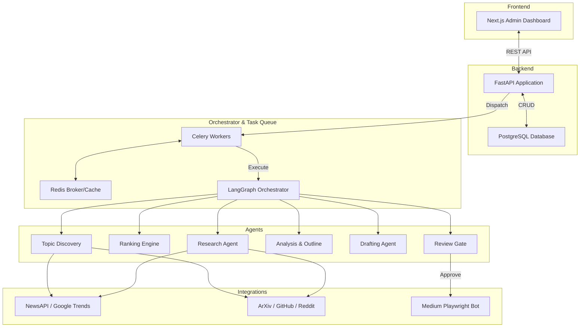
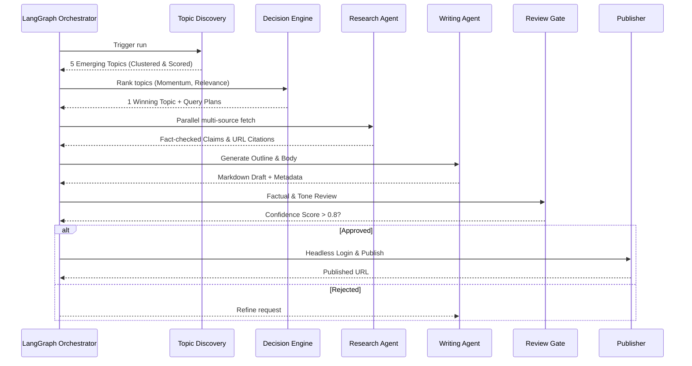

# 🤖 AI Content Automation Platform

An enterprise-grade, multi-agent AI platform that autonomously researches, drafts, reviews, and publishes high-quality technical articles to Medium. Powered by a stateful LangGraph orchestrator, FastAPI backend, and Next.js admin dashboard.

---

## 🌟 Key Features

- **Autonomous Agentic Workflow**: A strict, stateful OOP architecture where specialized agents perform structured reasoning loops (Plan-Execute-Reflect-Refine-Finalize).
- **Idempotent 2-Day Cadence**: Powered by Celery Beat and Redis to automatically execute research and publishing pipelines on schedule.
- **Robust Orchestrator**: LangGraph-based asynchronous architecture optimized for cost, scalability, and parallel execution of research tasks.
- **Medium Integration**: Automated headless publishing system utilizing Playwright to ensure stable content deployment.
- **Fail-safes & Confidence Scoring**: Configurable confidence thresholds prevent hallucinations and poor output from reaching the public.
- **Admin Dashboard**: A complete Next.js-powered oversight console for managing runs, approving drafts, and reviewing audit trails.

---

## 🏗 System Architecture

The platform is designed with a strict boundary between state management, tool execution, and LLM reasoning.



### Core Technologies
- **Backend API**: FastAPI + Python 3.11
- **Database**: PostgreSQL (SQLAlchemy & Alembic)
- **Queue/Broker**: Redis + Celery
- **Orchestration**: LangGraph, LangChain Core
- **Frontend**: Next.js (React, TailwindCSS)
- **Scraping & Publishing**: Playwright, BeautifulSoup, aiohttp
- **ML & Clustering**: scikit-learn, sentence-transformers
- **LLM APIs**: OpenRouter (OpenAI, Claude, etc.)

---

## 🧠 Agentic Workflow & State Flow

The backbone of the application is a multi-step pipeline where each agent acts strictly within its domain.



### Specialized Agents

1. **Topic Discovery Agent**: Pulls raw signals from Reddit, Hacker News, GitHub, and ArXiv. Deduplicates using embeddings, clusters using Agglomerative Clustering, and detects momentum.
2. **Ranking / Decision Engine**: Calculates scores based on trend growth, source diversity, and keyword strength. Rejects topics that fall below a confidence threshold.
3. **Research Agent**: Converts topics into specific research queries and asynchronously fetches data. Extracts factual claims and performs cross-validation to assign confidence scores.
4. **Analysis & Outline Agents**: Synthesizes the raw research into core insights and builds a structured Markdown outline optimized for human readability.
5. **Writing Agent**: Drafts the full article strictly based on the outline and extracted evidence. Generates SEO-optimized titles and subtitles.
6. **Review Agent**: A strict editor that grades the article on quality, factual consistency, and hallucination reduction. Acts as a publishing gatekeeper.

---

## 🚀 Getting Started

### Prerequisites
- Docker & Docker Compose
- Node.js v20+
- Python 3.11+
- OpenRouter / OpenAI API Key

### Local Development Setup

1. **Clone the repository:**
   ```bash
   git clone https://github.com/sushant-mutnale/Meduim_AI_Agent.git
   cd Meduim_AI_Agent
   ```

2. **Configure Environment Variables:**
   ```bash
   cp .env.example .env
   # Add your OPENAI_API_KEY, MEDIUM_USERNAME, MEDIUM_PASSWORD, etc.
   ```

3. **Start the Containerized Backend:**
   ```bash
   docker-compose up --build
   ```
   *The FastAPI backend will be available at `http://localhost:8000/docs`.*

4. **Start the Admin Dashboard:**
   ```bash
   cd dashboard
   npm install
   npm run dev
   ```
   *The Next.js dashboard will be available at `http://localhost:3000`.*

---

## 📂 Project Structure

```text
├── app/
│   ├── agents/          # LLM Agents (Discovery, Ranking, Research, Writing, Review)
│   ├── core/            # Configs, Celery App setup
│   ├── db/              # SQLAlchemy Models and Postgres Session
│   ├── jobs/            # LangGraph Pipeline & Celery Tasks
│   ├── services/        # 3rd-party Integrations (Playwright, Reddit, Google Trends)
│   ├── utils/           # Helper scripts (LLM execution, parsers)
│   └── main.py          # FastAPI Application Entrypoint
├── dashboard/           # Next.js Admin Console
├── medium-automation/   # Playwright scripts for Headless Medium Publishing
├── docker/              # Dockerfiles for Web and Celery workers
└── requirements.txt     # Python Dependencies
```

---

## 🛡️ License & Contributions
MIT License. Pull requests are welcome for architectural improvements or new agent capabilities.
